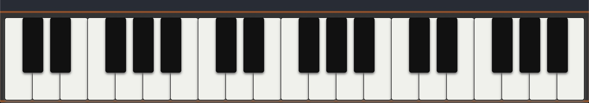

[MUSIN](https://victorzw895.github.io/musin/)

# Description

Musin is a web app for musicians who like to listen and play along to their favorite songs. It uses spotify API and GuitarParty API to allow users to search a song to play from spotify and the chords for the song.
There is also a built in digital piano that can be played along with the songs if there is no instrument on hand.

# Motivation

This app came from my passion for music and is a modified version of the original idea. Originally I wanted to build an app that would allow users to play their instruments at any place, any time without a physical instrument.
It would definitely use the spotify API and the GuitarParty API to provide the song and chords, however it would also make use of a motion sensor to detect up and down strumming patterns for guitarists or hand location for pianists.
The first iteration and most basic form is this current project. The second one would make use of a leap motion controller and the final iteration would make use of device like a arduino along with muscle sensors.

# Table of Contents

# Features

- View available chords for songs
- Autoscroll through song chords and lyrics for seamless playing
- Search and play songs from spotify
- Built in digital piano that used through keyboard inputs

# Usage

NOTE: In order to use the keyboard it has to be selected first by pressing TAB until the keyboard is highligted in orange.

# Technologies

React, Tone.js, Tonejs-instruments.js library, Spotify API, GuitarParty API

# TODO

1. ~~Keyboard keys CSS, highlight ones being pressed~~
2. ~~Error handling / Validations.~~
   - ~~If song search returns no songs~~
   - ~~If selected song has no chords~~
   - If song chords are not in original key
3. Add Original key info, add transposer
4. Get new chord images from different API
5. Consider not using Spotify iframe and build own player.
   - To sync play button with autoscroll
6. ~~Overall CSS~~
7. Leap Motion

# Challenges

### 1. Using Leap Motion Controller, how to add plugins to React

### 2. Using chord API is very restricting and limiting.

- There is currently one API from GuitarParty that is able to return chord information about any song, as long as it exists in their database.
- Downside is, all the chords/progression for every song has a different format based on which user submitted the chord progression.
- This makes it difficult to ensure that each song has the exact correct chords, specially when they have been transposed to simpler chords.
- GuitarParty API does not consistently return whether or not the chords returned are in the original key of the song
- Partial Solution: Add a transposer

### 3. Synching the chord progression from GuitarAPI with Spotify

- Currently GuitarAPI returns either all the chords used or the lyrics with the chord progression/changes placed next the lyric, where the chords change.
- Due to each song having a different tempo, rythm, length to each note or chord being played at a time, it is extremelly difficult to have it match up to the duration of the song.
- Possible that another library is required to listen to the song and return the lyrics, in order to match the lyrics with the chords provided from GuitarAPI.
- OR Possible if api returns each chord and how long each is played for

### 4. Use Leap Motion Controller to play 2D piano

- Leap Motion Controller has 3 axis (x, y, z) to return position and depth, allowing more accuracy.
- Translating its position to a 2D environment is not too complicated, however detecting whether a finger is moving downwards to press on a piano key is where the challenge lies.
- Need to detect all fingers at all times

# Credits

Thanks so much to Joel, Rashida, Linna and Charlie for continuous support and assistance throught the course and this project!
